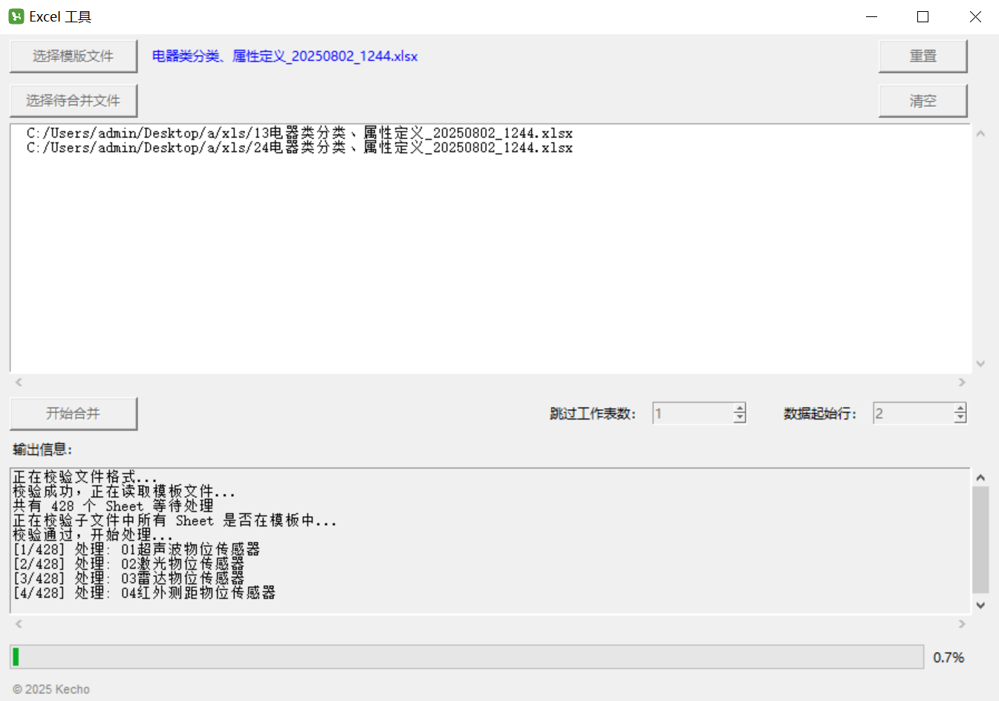

## 介绍

这是一款带 GUI 能够对 Excel 表格进行处理的工具。采用 Python Ttkinter 模块进行界面开发，使用 Pyinstaller 进行打包。

功能：

- [x] 对不同文件中相同 Sheet 名的数据进行合并
- [ ] 为所有 Sheet 制作目录
- [ ] 将表格中所有 Sheet 拆分成独立文件

### 多文件合并

合并原理：根据模板文件里面的 Sheet 名，对所有子文件里面的相同 Sheet 中的数据进行合并。

> 灵感来源：有一个大型模板表格，里面有许多 Sheet，每个人可能只涉及部分 Sheet，同一个 Sheet 也可能涉及到多个人，可以先将模板拆分成多个小模板发给对应的人，最后使用该工具进行合并。

特性：
- 自定义 tooltip 用于功能提示，并对显示区域进行限制，禁止超出软件窗口
- 支持自定义跳过工作表数和数据起始行，支持输入与提交合法性验证
- 选择待合并文件时支持追加文件
- 校验待合并文件中的 Sheet 名必须是模板文件中 Sheet 名的子集
- 模板文件类型仅支持标准 .xlsx 格式
- 支持进度条的动态展示与隐藏和按钮的动态启用与禁用以提示用户正确操作
- 修改软件内部与任务栏的默认图标

### 目录制作

（待完成）

### 文件拆分

（待完成）

## 打包

打包环境：Python 3.11.9

```bash
pip install pyinstaller openpyxl pandas xlrd

pyinstaller -Fw main.py --add-data "icon.ico;." --icon=icon.ico --name ExcelApp
```


## 界面



## 附录

打包后程序过大可以使用虚拟环境打包：

```bash
pip install virtualenv
virtualenv example_env  # 命名随意
cd example_env
Scripts\activate # 执行脚本激活环境

# 然后安装包和打包
# pip install pyinstaller
# pyinstaller -Fw main.py
```